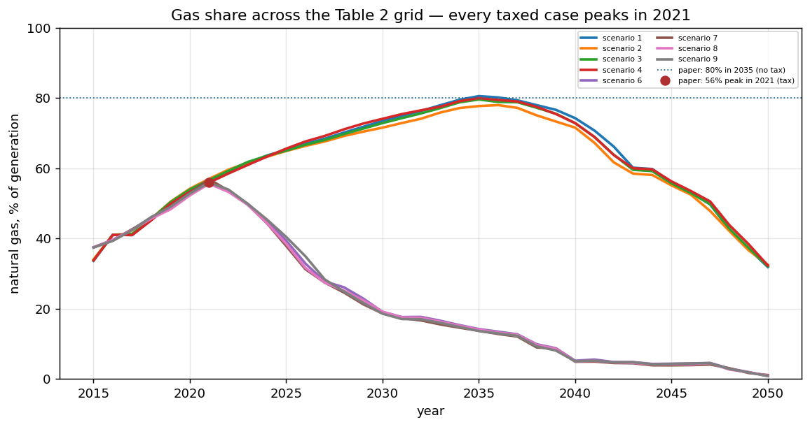

# sav-osemosys

[](https://colab.research.google.com/github/sear-labs/sav-osemosys-trd-2019/blob/main/notebooks/00_verify.ipynb) verify the published results, no solver needed

The OSeMOSYS ATX integrated energy–transportation model behind Jones and Leibowicz (2019),
*Transportation Research Part D* — [10.1016/j.trd.2019.05.005](https://doi.org/10.1016/j.trd.2019.05.005).

## This model was hard to find, so read this first

It existed in **seven divergent copies across five locations**, and the folder actually *named* after
the paper contained only `.bib` files — no code. Anyone asked to reproduce the paper started there and
stopped.

The copy here is the authoritative one: **138,734 bytes, dated 2018-05-30**. It wins because it is the
largest, it is the only copy that sat beside its own solver output, and its results files carry the
same date. The next-largest copy is 114,185 B and is a later variant; the smallest is 79,801 B.

## Two reproduction claims, and they are not the same

Keeping these apart is what finally made this paper reproducible. **Claim 1** is that the model
reproduces the run saved beside it in 2018. **Claim 2** is that it reproduces the ten scenarios
published in the article. The first was true for years and was repeatedly mistaken for the second.

## Claim 1: the model's own 2018 run — verified 2026-09-05

Re-solved unmodified on GAMS 42.5 / CPLEX, eight years after the original run:

```
18,813,038 equations x 18,760,518 variables, 43,631,324 non-zeros   (LP)
Baseline    85,409.6403   Optimal
CO2 policy  86,679.7693   Optimal
```

Against `reference-output/`, over **14,149 comparable numeric cells**:

| | bit-identical |
|---|---|
| Baseline | **98.35%** |
| CO₂ policy | **97.77%** |
| `AnnualEmissions` alone | **100%** (864/864) |

**The residual is degeneracy, not disagreement.** It concentrates exactly where a storage LP has
alternate optima:

| Section | cells differing |
|---|---|
| Storage levels (2050) | 33–56% |
| `NewCapacity` | 1.8% |
| Electricity production / use | 0.7–2.5% |
| `TotalAnnualCapacity` | 0.8% |
| `AnnualGenerationByTechnology` | 0.4% / 1.2% |
| **Total Storage Capacity** | **0%** |
| **New Storage Capacity** | **0%** |
| **AnnualEmissions** | **0%** |

Same cost, same totals, different dispatch schedule and build timing. Storage charge/discharge shifts
between timeslices at zero cost, so a modern CPLEX picks a different tie-break than the 2018 one did.

> **What this means for the model's own claims.** Cost and capacity totals reproduce. **Any statement
> naming a specific build year or a specific storage level does not** — it was never unique. Treat
> those as illustrative of one optimal solution rather than as the model's answer.

A further 315 rows have no counterpart because the bundled report writer emits **Year 2020** while the
reference CSVs were produced by one emitting **Year 2030**. That writer is not in this repository.

**Scenario 2 of the grid below is this same run**, and doubles as the regression test on the
rebuild: same demands, same absent tax, same charging paradigm. It returns `85,409.6403` and
validates at 98.35%, matching the tables above section for section. If the scenario driver ever
breaks, that is where it shows.

## Claim 2: the paper's ten published scenarios — verified 2026-09-06

**The paper runs ten scenarios. The 2018 run file runs two, and under the wrong policy
instrument.** That is why this paper resisted reproduction for years: the saved run was being
compared against published carbon-tax results while it applied an emissions *cap*.

Table 2 of the paper crosses SAV diffusion (70% by 2050 / none), carbon tax (yes / no), SAV
charging (optimized / night-only) and a travel-demand multiplier (0.5 / 1 / 2). The scenarios were
run in 2018 by hand-editing the driver between runs, so only the last state survived — and all five
surviving copies of `osemosys_run.gms` carry that same last state. Finding a better copy was never
going to help.

The grid now lives in [`scenarios/table2.csv`](scenarios/table2.csv) and is driven by
`model/osemosys_scenario.gms`. **Adding or changing a scenario is an edit to the CSV, never to the
GAMS.** The 2018 `osemosys_run.gms` is kept verbatim as the artifact and is not modified.

### The ten scenarios — solved 2026-09-06, GAMS 42.5 / CPLEX

| # | SAV | tax | charging | dm | objective | gas 2035 | gas peak | year |
|---|---|---|---|---|---|---|---|---|
| 1 | 70% | no | optimized | 0.5 | 66,113.20 | 80.6% | 80.6% | 2035 |
| 2 | 70% | no | optimized | 2 | 85,409.64 | 77.7% | 78.0% | 2036 |
| 3 | 70% | no | optimized | 1 | 72,412.33 | 79.6% | 79.6% | 2035 |
| 4 | 70% | no | night only | 1 | 75,110.56 | 80.0% | 80.0% | 2035 |
| 5 | none | no | n/a | n/a | 92,091.39 | 80.5% | 80.5% | 2035 |
| 6 | 70% | **yes** | optimized | 0.5 | 71,267.76 | 14.2% | 55.7% | **2021** |
| 7 | 70% | **yes** | optimized | 2 | 90,819.95 | 13.7% | 56.9% | **2021** |
| 8 | 70% | **yes** | optimized | 1 | 77,638.36 | 14.0% | 55.6% | **2021** |
| 9 | 70% | **yes** | night only | 1 | 80,451.63 | 13.6% | 55.9% | **2021** |
| 10 | none | **yes** | n/a | n/a | 97,883.08 | 14.3% | 55.7% | **2021** |

43.8 minutes for all ten, run sequentially.

### The acceptance test — and it passes



*Every taxed scenario peaks in 2021 — the paper's year — regardless of demand multiplier
or charging paradigm. Regenerate with `python scripts/make_figures.py`; it needs no solver.*


The paper prints **no cost figures at all**: Fig. 10 gives objective values as bar heights only,
with no table, so not one number in the objective column above can be checked against the article.
The electricity mix is the only published quantity this model can be held to, and the paper states
two figures. Against a generation-only denominator (storage, V2G and charging also produce ELC and
are excluded):

| Paper | Central case | Result |
|---|---|---|
| No tax: natural gas "accounts for **80%** of electricity produced" in 2035 | scenario 3 | **79.6%** — off by 0.4 |
| Carbon tax: natural gas "peaks at **56%**" share in **2021** | scenario 8 | **55.6% in 2021** — off by 0.4, year exact |

**All five taxed scenarios peak in 2021**, at 55.6–56.9%, straddling the published 56%. All four
SAV no-tax scenarios land at 77.7–80.6% in 2035, straddling the published 80%.

**The peak year is the load-bearing evidence.** The old cap run peaks at 54.6% in **2025** — right
magnitude, four years late, which is exactly what a cap ramping linearly to 2050 does compared with
a tax that bites immediately. Enabling the tax moves the peak to 2021, and it stays there across
every taxed case regardless of demand multiplier or charging paradigm. That is a signature, not a
coincidence.

### Two things worth knowing about the 2018 file

**The saved 2018 run is scenario 2, not the central case.** The data file carries `scalar DM /2/`,
so what reproduces at 98.35% above is the `dm=2` corner of the grid — and at 77.7% it is the
*worst* match to the paper's 80% of any no-tax scenario. The central case (`dm=1`, scenario 3)
gives 79.6%. Do not read the shipped state as the headline case.

**The paper's tax is already in the data file, built and then discarded.**
`ATX_Integrated_Final_Fleet.gms` constructs `EmissionsPenalty` at $20/tCO₂ projected forward at 5%
a year — exactly the published policy — and then zeroes it on the very next line. The run file
carries the same pair commented out, below the cap. The scenario driver restores it rather than
reinventing it.

## The model in Python — and why that is the point

GAMS is licensed for everyone, academics included. So until now, **reading this model's
formulation at all required commercial software** — not solving it, reading it. CPLEX was
never the real barrier.

`src/sav_osemosys/` is the same model in gurobipy, reading the same open CSVs. Anyone can
read it; anyone with a free Gurobi academic licence can solve it; and the reduced instance
in the example notebook solves with `highspy`, which needs no licence at all.

```bash
pip install -e ".[gurobi]"
python scripts/reconcile.py          # every scenario, against GAMS
```

### It agrees with GAMS on all ten scenarios

| # | scenario | gurobipy | GAMS | relative |
|---|---|---:|---:|---:|
| 1 | 70% / no tax / optimized / 0.5 | 66,113.1982 | 66,113.1982 | 1.3e-11 |
| 2 | 70% / no tax / optimized / 2 | 85,409.6403 | 85,409.6403 | 4.7e-10 |
| 3 | 70% / no tax / optimized / 1 | 72,412.3298 | 72,412.3298 | 1.2e-11 |
| 4 | 70% / no tax / **night** / 1 | 75,110.5639 | 75,110.5565 | 9.9e-08 |
| 5 | none / no tax | 92,091.3874 | 92,091.3874 | 1.3e-10 |
| 6 | 70% / **tax** / optimized / 0.5 | 71,267.7622 | 71,267.7622 | 6.1e-16 |
| 7 | 70% / **tax** / optimized / 2 | 90,819.9507 | 90,819.9507 | 3.8e-10 |
| 8 | 70% / **tax** / optimized / 1 | 77,638.3617 | 77,638.3617 | 6.3e-10 |
| 9 | 70% / **tax** / **night** / 1 | 80,451.6360 | 80,451.6299 | 7.6e-08 |
| 10 | none / **tax** | 97,883.0846 | 97,883.0846 | 1.1e-10 |

GAMS objectives are read from the **GDX**, never from the results CSV — that writer prints
two decimals, which is enough to hide a real disagreement and enough to manufacture a fake
one.

**Eight of ten agree to 1e-10 or better. The two that do not are both night-charging
cases**, at ~1e-7 — a thousand times the others, and worth naming rather than averaging
into a summary statistic. It is not infeasibility: the primal residual on those solves is
4.5e-15 relative to the largest matrix coefficient. Both solvers' optimality tolerances
are 1e-6 relative, so a 1e-7 disagreement is inside the range neither claims to resolve on
a degenerate, badly scaled problem. Forcing daytime charging to zero makes the problem
more degenerate, which is presumably why those two cases are where it shows.

### It is smaller than GAMS, and that is not an approximation

| | GAMS | gurobipy |
|---|---:|---:|
| variables | 18,760,518 | **1,562,993** |
| build time | 72 s | **42 s** |
| after presolve | — | 116,729 x 105,971 |

GAMS generates `ProductionByTechnology` for every technology-fuel pair, including (coal
plant, gasoline). **51 of 765 pairs actually produce anything and 44 consume** — 6.7% and
5.8%. A variable that exists only to be forced to zero is padding, and presolve removes it
anyway; this declines to create it. The mathematics is identical, which is what the
reconciliation above establishes.

### What does NOT reproduce, and why

Cost and totals reproduce. **Dispatch and build timing do not, and were never unique.**
After the objective matches, the surviving solution differences are of two kinds:

- **differences under 0.005** — the results CSV prints two decimals, so these are the
  print format, not the model.
- **`EV_DISCHARGE` and `EV_DISCHARGE_F`**, differing by 9-22%. Nothing constrains their
  capacity and nothing charges for it, so the optimum does not determine them. Any value
  is as optimal as any other.

That is the whole residual. It is stated here rather than left as an unexplained gap,
because an unexplained residual is indistinguishable from an unfound bug.

### One thing a port misses by construction

The formulation is 107 equations, and porting them one at a time is not sufficient. This
model also carries a variable **bound**, in the data file among the variable declarations:

```gams
ProductionByTechnology.fx(y, LowV2G, "EV_CHARGE", f, r) = 0;
```

Private EV charging is fixed to zero in every daytime timeslice — always, in every
scenario. Omitting it left the objective 1.70 low on 72,412: too small to notice, far too
large to be arithmetic, and invisible to a check that walks the equation list. **Grep the
source for bound attributes before believing a port is complete.** There is exactly one in
this model, which is precisely why it was easy to miss.

The line directly below it does the same for the *fleet* charger and is commented out.
That is why night-only charging is a scenario lever for the fleet and a permanent fact for
private cars.

## Running it

**Start here — nothing below needs a solver or a licence.** Both notebooks install
the package and its three dependencies; neither needs Gurobi, GAMS or CPLEX.

| | what it needs | what it does |
|---|---|---|
| [`notebooks/00_verify.ipynb`](notebooks/00_verify.ipynb) [](https://colab.research.google.com/github/sear-labs/sav-osemosys-trd-2019/blob/main/notebooks/00_verify.ipynb) | **no solver, no licence** (numpy, pandas, matplotlib) | checks the published results and a shipped instance, row by row |
| [`notebooks/01_model.ipynb`](notebooks/01_model.ipynb) [](https://colab.research.google.com/github/sear-labs/sav-osemosys-trd-2019/blob/main/notebooks/01_model.ipynb) | `highspy` | reads the whole formulation, then builds and solves a reduced instance |

Both fetch their data from this repository if you have not cloned it, so they run in Colab
untouched.

### Locally

```bash
pip install -e ".[dev]"
pytest -q                              # 37 tests, no solver, no licence
python scripts/test_offline.py         # the checks CI would run, ~1 s
```

### The model, in Python — the default path

```bash
pip install -e ".[gurobi]"
python scripts/export_reduced.py       # rebuild the shipped .mps / .sol
python scripts/reconcile.py            # every scenario, against GAMS
```

Gurobi is the default solver because a **free academic licence** is unlimited in size. The
licence bundled with the `gurobipy` package is **not** enough: it caps at 2,000 variables, and
the smallest useful version of this model is 4,726 — measured, not assumed. For no licence at
all, use HiGHS on the shipped reduced instance, which is what `01_model.ipynb` does.

### The GAMS model — the original, kept as the alternate

The 2018 GAMS model is what produced the published results, and it is preserved verbatim. It
needs **both** a GAMS licence and a commercial LP solver, which is the barrier the Python port
exists to remove.

```bash
python scripts/run_scenarios.py        # all ten scenarios, ~44 min
python scripts/check_results.py        # the grid, the levers and the acceptance test
python scripts/clean_output.py         # raw GAMS output -> tidy results/clean/
python scripts/run_scenarios.py --only 4,9    # scenarios are independent; resume anytime
```

⚠️ **`solprint=off`, always.** `osemosys_run.gms` ships with `solprint=on`, which over 17.6M
variables writes a listing that passed **4.7 GB and was still growing** when interrupted. The
scenario driver sets it off, and `test_offline.py` fails if that is ever undone.

⚠️ **One solve at a time.** A GAMS solve peaks near 16 GB on a 32 GB machine. `run_scenarios.py`
is sequential deliberately.

⚠️ **`execute_unload` is restricted** to the reported symbols. Unrestricted it writes every
symbol in an 18.7M-variable model — 954 MB per scenario, 9.5 GB across the grid.

### What lives where

    data/instance/       the model instance, 102 CSVs, readable with no licence
    scenarios/           the Table 2 grid - editing this is how you add a scenario
    src/sav_osemosys/    the model in gurobipy: sets, parameters, variables,
                         constraints, objective, figures, verification
    model/               the 2018 GAMS model, verbatim, plus the rebuilt scenario driver
    results/clean/       tidy results - what the notebooks and figures read
    figures/             published figures, regenerated by scripts/make_figures.py
    artifacts/           the reduced instance as .mps / .sol, for solving without Gurobi
    notebooks/           shipped executed, with their outputs

There is no CI, because every GAMS solve needs two commercial licences. `pytest` and
`scripts/test_offline.py` cover everything that does not, and are the suite CI would run.

## How the rebuild is kept honest

Ten scenarios that were quietly the *same* scenario would all solve and all report success, so "the
run succeeded" is not evidence that anything was applied. Four checks exist for that:

- **The demand agreement assertion**, in `osemosys_scenario.gms`. The SAV cases split one travel
  demand into private VMT and fleet FMT; the no-SAV case is that demand undivided. The driver
  asserts `VMT + FMT` equals the no-SAV row in every year — which tests the split hypothesis, the
  recovery of the base FMT row, and the transcribed CSV, all at once. Measured agreement: 2.0e-4
  against a 1e-3 tolerance.
- **The lever check**, in `check_results.py`. Every run records what its levers actually did to
  `results/scenario-NN/levers.csv`; the checker re-derives what they should have been from the grid
  and compares. The levers are confirmed from the outputs, never from the inputs the runner was
  handed.
- **The fleet check.** For the no-SAV cases `NewCapacity` must be zero for all six fleet
  technologies in all 36 years, and non-zero for the SAV cases. This tests `NewCapacity`, not
  `TotalAnnualCapacity`: the 2015 column carries inherited stock — 180 thousand `ICE_PET_F`, 2
  thousand `EV_F` — that exists whatever the scenario says and is retired in the first period.
- **Two cost invariants**, which hold by optimisation rather than by energy policy: a carbon tax
  cannot lower total cost, and night-only charging cannot beat optimized charging. Both compare
  scenarios differing in exactly one lever, so a violation means the solve or the lever is wrong,
  not that the model has said something interesting. *(That no-SAV costs more than SAV is a
  **result**, not a theorem — the two have different demand structures — so it is reported and not
  asserted.)*

Every one of these has been watched to fail: defect injected, check red, defect removed, check
green. A guard that has only ever passed is indistinguishable from one that cannot fail.

## Data

**Self-contained.** All parameters are inline in `model/ATX_Integrated_Final_Fleet.gms`; the model
reads no external file. Sources are cited in the source itself: **NREL SAM**, the **EIA Power
Generator Database**, and the **NREL 2016 Annual Technology Baseline** — all public.

Parameter workbooks (`Parameters.xlsx` and others) exist alongside the originals on the lab Drive but
are **not included**: their provenance has not been verified and the model does not read them.

The bundled 2018 `.lst`/`.log` are also excluded. They are not a solve — the log shows the licence had
expired eleven days earlier and the job ran for 0.058 s, compiling the data file directly. **The CSVs
are the only reproduction target.**

## Attribution

`osemosys_run.gms` is headed **Benjamin D. Leibowicz**. **OSeMOSYS** itself is third-party open-source
work — Howells et al., *Energy Policy* 39(10), 2011 — and this repository is an application of it, not
a redistribution of the framework.

## How to cite

> Jones, Erick C., Jr., and Benjamin D. Leibowicz. "Contributions of shared autonomous vehicles to
> climate change mitigation." *Transportation Research Part D*, 2019. doi:10.1016/j.trd.2019.05.005

BibTeX: `author = {Jones, Jr., Erick C. and Leibowicz, Benjamin D.}` — the suffix is the middle field.

## Licence

MIT for this repository's contents — see `LICENSE`.
